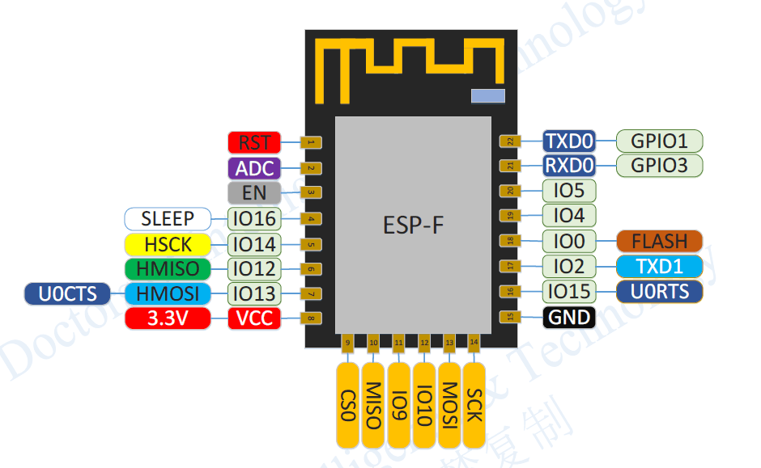

# ESP8266介绍
  首先，认识一下ESP8266-12F的引脚定义，通常会隐藏最下面一行的pin6-pin11，如下图：

  

  完整的引脚图如下：

  

  通过引脚图可知：
    1. 12F共有22个引脚，共包含GPIO0-GPIO16共17个引脚。但是得注意有些IO口还可以完成其他功能（也叫做引脚复用），诸如Serial、I2C、SPI，由相应的函数库完成
    2. ESP8266具有一个可用的单通道ADC
    3. GPIO6-GPIO11（复用引脚CS、MISO、MOSI、SCK）用于连接外部flash，对用户不可用，试图使用这些引脚作为IO将会导致程序奔溃
    4. 支持SPI总线通信，对应引脚为GPIO12-GPIO15
    5. 支持I2C总线，对应引脚为GPIO4-GPIO5
    6. 支持串口通信Serial、Serial1，默认对应引脚GPIO1-GPIO3

## ESP8266官方介绍
 [https://arduino-esp8266.readthedocs.io/en/2.4.2/libraries.html](https://arduino-esp8266.readthedocs.io/en/2.4.2/libraries.html)

# ESP8266-12F扩展板NodeMcu介绍
  ESP8266-12F与NodeMcu的端口映射关系，如下图
  
  图中的蓝色部分表示当前NodeMcu上的接口，外部为对应12F接口。
  NodeMcu上的CLK、SD0、CMD、SD1、SD2引脚，是用于连接外接flash芯片，不应该用于连接其他模块，悬空即可，以防程序奔溃。  
  |NodeMCU的引脚名称|ESP8266内部GPIO引脚号|可复用功能|备注|
  |:---:|:---:|:---:|:---:|:---:|
  |D0|GPIO16|无|可用，只能用作GPIO读/写，不支持特殊功能|
  |D1|GPIO5|I2C总线的SCL|可用|
  |D2|GPIO4|I2C总线的SDA|可用|
  |D3|GPIO0|无|不可用，烧录固件或者运行模式控制端口|
  |D4|GPIO2|Serial1的TX|Serial1没有RX|
  |D5|GPIO14|SPI总线的SCLK|可用|
  |D6|GPIO12|SPI总线的MISO|可用|
  |D7|GPIO13|SPI总线的MOSI、Serial的RX|可用|
  |D8|GPIO15|SPI总线的CS、Serial的TX|可用|
  |D9|GPIO3|Serial的RX|可用|
  |D10|GPIO1|Serial的TX|可用|
  |SD2|GPIO9|无|尽量不用|
  |SD3|GPIO10|无|尽量不用|
  |A0|ADC|无|可用|
  从上面表格可以看出，我们大约11个GPIO引脚可用。而11个中的2个引脚通常被保留用于RX和TX，以便进行串口通信。因此最后，只剩下8个通用I / O引脚，即D0到D8（除开D3特殊用途）。
  请注意，D0 / GPIO16引脚只能用作GPIO读/写，不支持特殊功能（PWM）
  在Arduino，编号前带有“A”的引脚是模拟输入引脚，Arduino可以读取这些引脚上输入的模拟值，也就是可以读取引脚上输入的电压大小。模拟输入引脚带有ADC功能（ADC：Analog-to-Digital Converter 模数转换）。它可以将外部输入的模拟信号转换为芯片运算时可以识别的数字信号，从而实现读取模拟值的功能。

  Ardunio与计算机通信最常用的方式就是串口通信。在Arduino控制器上，串口都是位于Rx和Tx两个引脚
  
### 参考文章
  dalao文章
  [单片机菜鸟](https://www.arduino.cn/thread-82353-1-1.html)
  [奈何col](https://www.arduino.cn/forum.php?mod=viewthread&tid=1066&extra=page%3D1)
# ESP8266项目简介
# ESP8266