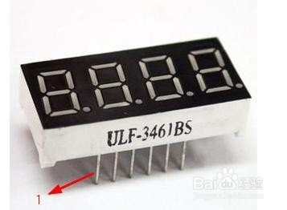
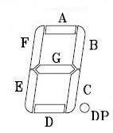

## 4位8段数码管
[引脚说明](https://jingyan.baidu.com/album/1709ad80bfc8e84634c4f011.html)
[显示说明](https://blog.csdn.net/a1a38181/article/details/52946242)

> 如图，正放是左下角为1号脚，逆时针依次为1~12脚。

> 一个数字8位由这8个灯控制，其脚位对应关系如下表

|8段引脚|含义|
|:---:|:---:|
|1|e|
|2|d|
|3|dp|
|4|c|
|5|g|
|6|4|
|7|b|
|8|3|
|9|2|
|10|f|
|11|a|
|12|1|

1. a~f+dp(小数点)对应一个数字上的8个灯（包含小数点），在共阳极中，1-4（含义列）为正，则对应4位数的某一位亮起。
2. 例如（所有数字为含义列）：1位正极，abcdef为负极，g,dp为正极，此时四个数字的第一个显示数字0，简化表示：1+11000000。引申：2+11111001 表示第二个数字亮起为数字1
3. 总体来说，实际操作中四位数一次只能显示一个数字，如果需要同时展示四个数字，这就依靠人体的视觉暂留实现，通过快速刷新（毫秒级）四个数字，那么就能展示出一个四位数。